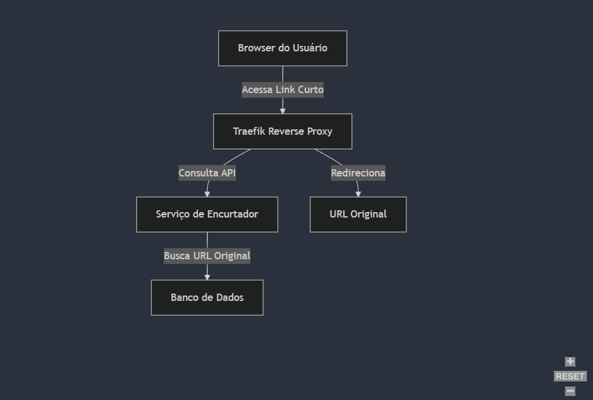

# Link Shortener

Link shortener, made in Java, with Spring Framework.

## About the Project

This project is based on the challenge proposed by [Rafa Coelho](https://racoelho.com.br/listas/desafios/encurtador-de-links) to create a URL shortener. The goal is to develop an API that receives long URLs and returns shortened versions while maintaining a record of the original URLs.

## Features

- URL shortening
- Redirection to original URLs
- URL validation
- Duplicate URL handling
- Unit tests with JUnit and Mockito

## Technologies Used

- Java 17
- Spring Boot
- PostgreSQL
- JUnit 5
- Mockito
- Docker
- Traefik (Reverse Proxy)
- GitHub Actions (CI)

## Architecture


<span style="font-size: 0.9em;">Image Reference: [#8 Encurtador de Links](https://racoelho.com.br/listas/desafios/encurtador-de-links)</span>

The application follows a microservices architecture pattern with the following components:

- **Traefik**: Acts as a reverse proxy and load balancer, handling incoming requests and routing them to the appropriate service
- **Spring Boot Application**: Core application that handles URL shortening logic
- **PostgreSQL**: Database for storing URL mappings
- **Docker**: Containerization of all components

### Traefik Configuration

Traefik is configured as a reverse proxy to:
- Handle SSL/TLS termination
- Provide automatic HTTPS
- Load balance incoming requests
- Enable service discovery

## How to Run

### Requirements
- Java 17
- Docker
- Maven

### Execution Steps

1. Clone the repository
```bash
git clone https://github.com/your-username/linkshortener.git
```

2. Start the Docker containers (PostgreSQL and Traefik)
```bash
docker-compose up -d
```

3. Run the application
```bash
./mvnw spring-boot:run
```

## Endpoints

### Shorten URL
```http
POST /api/shortener
Content-Type: application/json

{
    "originalUrl": "https://www.example.com/very-long-page"
}
```

Success response:
```json
{
    "shortCode": "abc123",
    "originalUrl": "https://www.example.com/very-long-page",
    "shortUrl": "http://localhost:8080/abc123"
}
```

### Access Original URL
```http
GET /{shortCode}
```

## Application Flow

1. Client sends a URL to be shortened
2. System validates if the URL is valid
3. System checks if the URL already exists in the database
   - If it exists, returns the existing short code
   - If it doesn't exist, generates a new short code
4. System stores the new URL in the database
5. System returns the short code to the client
6. When the short code is accessed, the system redirects to the original URL

## Continuous Integration (CI)

The project uses GitHub Actions for:
- Running automated tests
- Code quality verification
- Ensuring tests pass before accepting PRs

### CI Pipeline

Tests are automatically executed:
- On each Pull Request
- On merge with the main branch
- Using the configuration defined in `.github/workflows/tests.yml`

## Tests

The project includes unit tests using JUnit and Mockito. To run the tests:

```bash
./mvnw test
```

### Test Coverage

Main tested components include:
- ShortLinkService
- URL validations
- Duplicate handling
- Short code generation

## Pull Requests and Development History

The project was developed incrementally through several Pull Requests, including:

1. Initial project setup and basic structure
2. URL shortener implementation
3. URL validation addition
4. Duplicate URL handling
5. Unit tests implementation
6. CI/CD configuration
